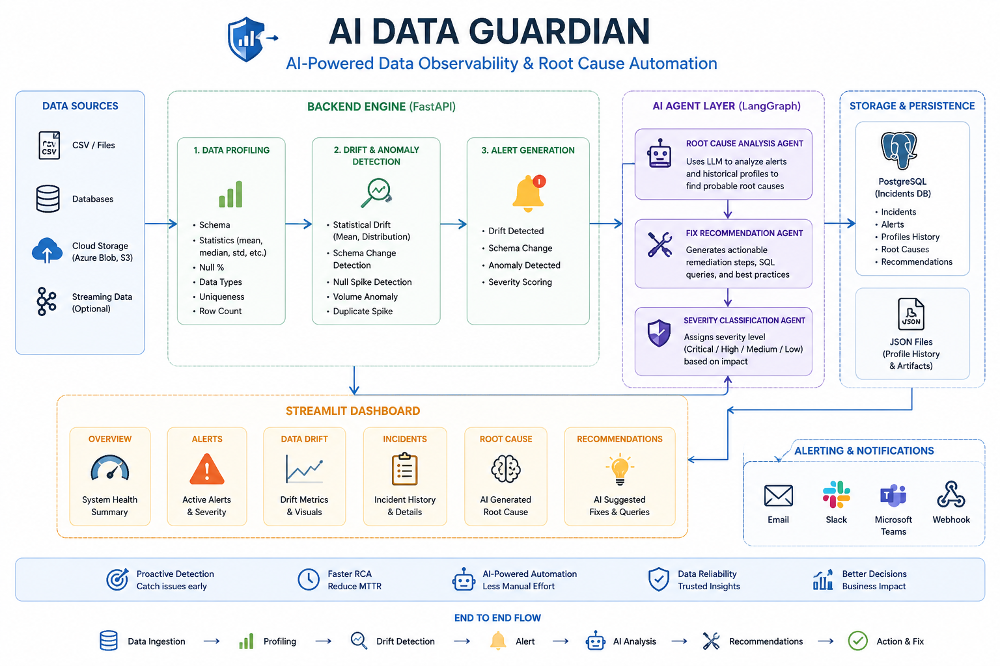
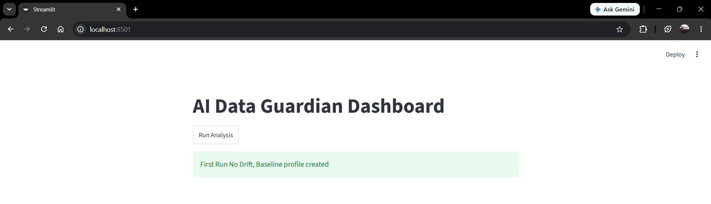

# 🤖 AI Data Guardian

AI Data Guardian is a production-inspired AI-powered data observability platform that automatically detects data quality issues, performs AI-driven root cause analysis, recommends fixes, and manages incidents.

---
## Latest Features Added

- LangGraph Multi-Agent Orchestration
- Unit Testing
  
## 🚀 Features

- Data Profiling
- Statistical Drift Detection
- Schema Drift Detection
- Null Spike Detection
- Volume Anomaly Detection
- Duplicate Detection
- AI Root Cause Analysis
- AI Fix Recommendation
- Incident Management
- Structured Logging
- PostgreSQL Incident Storage
- FastAPI REST API
- Streamlit Dashboard
- Dockerized Deployment

---

## 🏗 Architecture



---

## Tech Stack

| Technology | Usage |
|------------|------|
| Python | Core Application |
| FastAPI | REST API |
| Streamlit | Dashboard |
| PostgreSQL | Incident Storage |
| Docker | Containerization |
| Pandas | Data Profiling |
| Groq LLM | Root Cause Analysis |
| Logging | Observability |

---

## Project Workflow

Dataset

↓

Profiling

↓

Drift Detection

↓

Root Cause AI Agent

↓

Fix Recommendation Agent

↓

Incident Management

↓

Dashboard

---

## Screenshots

### Dashboard



---

## Getting Started

Clone repository

```bash
git clone https://github.com/YOUR_USERNAME/AI-Data-Guardian.git
```

Go to project

```bash
cd AI-Data-Guardian
```

Start Docker

```bash
docker compose up --build
```

Dashboard

```
http://localhost:8501
```

API

```
http://localhost:8000/docs
```

---

## Upcoming Features


- GitHub Actions CI/CD
- Email/Slack Notifications
- Authentication
- Cloud Deployment

---

## Author

**Sumit Nalwade**

Data Engineer | AI Engineer | Machine Learning Enthusiast
